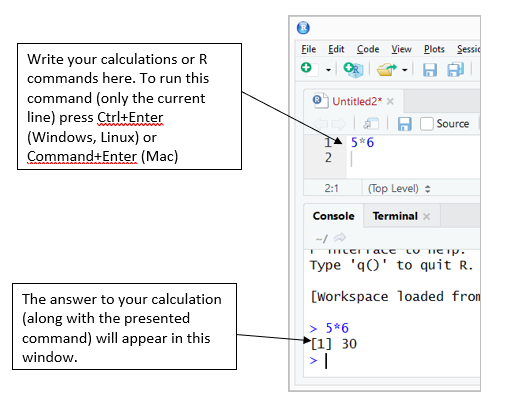

 
```{r setup, cache=FALSE, include=FALSE}
knitr::opts_chunk$set(collapse = FALSE)

hook1 <- function(x){ gsub("```\n*```r*\n*", "", x) }
hook2 <- function(x){ gsub("```\n+```\n", "", x) }
#knitr::knit_hooks$set(document = hook2)

```


# RStudio ja kasutajaliides

Ava Start-menüü ja otsi programm nimega RStudio, käivita see.



Avanenud programmiaken jaguneb neljaks. Akende paigutust saab oma suva järgi muuta, kuid esialgu paiknevad paremal aknad, mis annavad ülevaate kasutatavatest kaustadest, defineeritud muutujatest, graafikutest jne ning vasakul on R-i konsool ja tekstiredaktor käskude kirjapanekuks;

* R konsool
    - alumine vasakpoolne aken on programmi R konsooliaknen, kuhu saab programmi käsud kirjutada viiba `>` järele;
    -	käsk täidetakse pärast `Enter`-klahvi vajutamist;
    -	varem sisestatud käske saab tagasi sirvida nooleklahviga $\uparrow$;
    -	plussmärk `+` rea ees näitab, et käsk on pooleli.
    - kui midagi läks valesti ja R ei hakka tegema seda, mida soovid, siis vajuta `Esc` klahvi.
* Tekstiredaktor ehk skriptiaken
    - tekstiredaktorisse saate kirjutada R-i käsud/koodi ja kommentaarid;
    - käsufaili ühel real peab olema kirjutatud üks käsk (reavahetus näitab programmile käsu lõppu), kui soovid ühele reale kirjutada mitu käsku, siis need tuleb eraldada semikooloniga `;`
    - kommentaari lisamiseks tuleb vastava rea algusess lisada `#`-märk;
    - mingi koodilõigu käivitamiseks tuleb see hiirega ära valida ning vajutada klahvikombinatsiooni `Ctrl+Enter`.


\pagebreak
Sriptiaknas on mõislik käskudele lisada kommentaare, et teinekord või teisel inimesel oleks koodi lihtsam lugeda. **Kommentaare** saab R-i koodis lisada ainult rea lõppu, kasutades trellide-sümbolit:

```{r,eval=TRUE}
log(5.9)  # võtame naturaallogaritmi arvust 5,9
# terve see rida on kommentaar, sest rea alguses on # ehk trellide sümbol
```


## Lihtsam aritmeetika
R-is on võimalik teha kõiki lihtsamaid aritmeetilisi tehteid, sealjuures järgitakse matemaatikas kasutatavat tehete järjekorda (sulgusid lisades on võimalik seda muuta): 

- `1 + (2 - 3) * 4 / 5`
- `2^3 - 2**3` -- astendamiseks saab kasutada sümboleid `^` ja `**`
- `5 %% 3` -- modulo (jääk jagamisel)
- `log(exp(1)) * cos(-pi) * sqrt(9) + factorial(4) - choose(4, 2) * min(4, 5, 2)`   
   on sama, mis $\ln{(e^1)} \cdot \cos{(-\pi)} \cdot \sqrt{9} + 4! - \binom{4}{2} \cdot \min(4,5,2)$
- `1/0` annab tulemuseks `Inf` (*infinity*)
- `0/0` annab tulemuseks `NaN` (*not a number*)

### Ülesanded

1. Arvuta enda kehamassiindeks: kaal (kg) / pikkus^2^ (m^2^). (teistele ei pea näitama.)

\
\


## Käsud ja abi saamine

Ülalolevad aritmeetikaavaldised `sqrt(9)`, `choose(4, 2)` jne on tegelikult **käsud** ehk **funktsioonid**, mis oskavad teatud asju teha (praeguses näites teatud arvutusi teha). Kõigil käskudel on sarnane süntaks:

`käsk(argumendid)`

Üldiselt on käsu argumentidel ka nimed, näiteks käsk `choose` tahab täpselt kahte argumenti: `n` ja `k`. Mõnikord on kasulik argumentide nimed välja kirjutada, et hiljem koodi üle lugedes oleks aru saada, mida miski tähendab:
```{r,eval=FALSE}
choose(n = 4, k = 2)
```

Osadel käskudel on mõnedele argumentidele antud  niinimetatud vaikimisi väärtused. Neid argumente ei pea (aga võib) käsu kasutamisel välja kirjutama kui vaikimisi argument on parajasti sobiv väärtus. Näiteks on käsul `log` vaikimisi määratud argumendi `base` ehk logaritmi aluse väärtus arvuga $e \approx 2.718282$ st käsk arvutab naturaallogaritmi. Kui on soov leida naturaallogaritmi arvust 8, siis võib käsu kirja panna  `log(8)`, kui aga on vaja leida arvu 8 logaritmi baasil 2, siis tuleks argumendi `base` vaikimisi väärtust muuta, ehk
```{r}
log(8, base = 2)
```

Kui mingi konkreetse käsu kohta soovitakse abi saada (näiteks kontrollida, mis on käsu argumentide nimed ja millises järjekorras need tuleks ette anda), võib abi otsida RStudio abiaknast (paremal all, `Help` vahelehel).
 

Tasub tähele panna, et R on (nagu suurem osa programmeerimiskeeli) **tõstutundlik** -- see tähendab, et programm eristab suuri ja väikeseid tähti. Kui ajada käsu või argumendi nimes mõni suur- ja väiketäht segi, siis on tulemuseks veateade:
```{r,error=TRUE}
Log(5)
log(8, BASE = 2)
```

# Muutujatega töötamine

## Väärtuste omistamine ja töökeskkond (*environment*)
Sageli on mugav, kui töös kasutatavatele muutujatele nimi anda -- siis saame neid edaspidi nimepidi kutsuda. Näiteks kui nimetada `kaal <- 70`  ja  `pikkus <- 185` ehk konsoolil
```{r}
kaal <- 70
pikkus <- 185
```
siis saaks kehamassiindeksit arvutada nii:
```{r}
kaal / (pikkus / 100)**2
```

Tekitasime  esimesel sammul töökeskkonda kaks objekti, mille nimed on `kaal` ja `pikkus`. Täpsemini: tekitasime objektid `kaal` ja `pikkus`, millele omistasime väärtused 70 ja 185. Sümboliühendit `<-` nimetatakse omistamisoperaatoriks. Üldjuhul töötab omistamisoperaatorina ka võrdusmärk `=`, ent on mõned erandjuhtumid, kus need erinevalt töötavad; lisaks on võrdusmärk kasutusel käskude argumentidele väärtuse andmisel.

Kui nüüd muuta `kaal` väärtust: `kaal <- 90` `r kaal <- 90`, siis konsoolis ülesnoolega üle-eelmise käsu (KMI arvutamise) üles otsides saab seda lihtsasti uuesti jooksutada.
```{r}
kaal / (pikkus / 100)**2
```

Siit maksab tähele panna ka seda, et muutujale uut väärtust omistades kirjutatakse vana lihtsalt üle, mingit hoiatust R ei anna.

Töökeskkonnas olevatest objektidest saab ülevaate aknast `Environment` (paremal üleval).

# Lisapakettide kasutamine

Üks R-i populaarseks muutumise põhjuseid on rikkalik lisapakkettide olemasolu. Tõenäoliselt leidub iga praktilise statistika-alase (ja ka mõne muu valdkonna) probleemi jaoks omaette pakett (*package*). Siinkohal vaatame aga jooniste tegemise paketi `ggplot2`.

Lisapaketid ei ole tavaliselt R-iga kaasas, vaid need tuleb paigaldada. Kui paigaldatav pakett vajab omakorda mingeid muid pakette, siis paigaldatakse ka need.

Paigaldame lisapaketi `ggplot2` ja talle vajalikud paketid:
```{r, eval=FALSE}
install.packages("ggplot2")
```

Kui pakett on paigaldatud, siis järgmisel töösessioonil seda enam uuesti paigaldama ei pea. Küll aga tuleb arvutisse paigaldatud paketid igal uuel R-i sessioonil sisse laadida käsuga `library` (või `require`), mille argumendiks on laaditava paketi nimi:
```{r, results='hide', warning=FALSE}
library(ggplot2)
```


